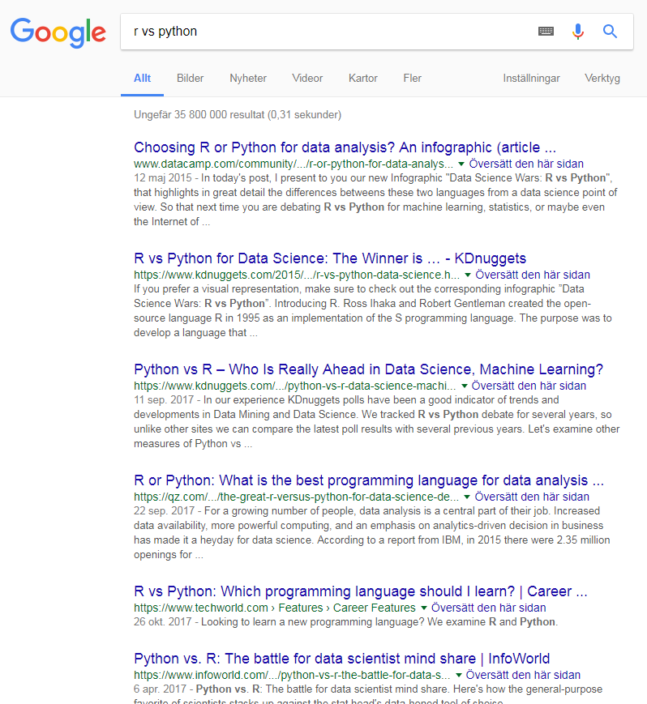
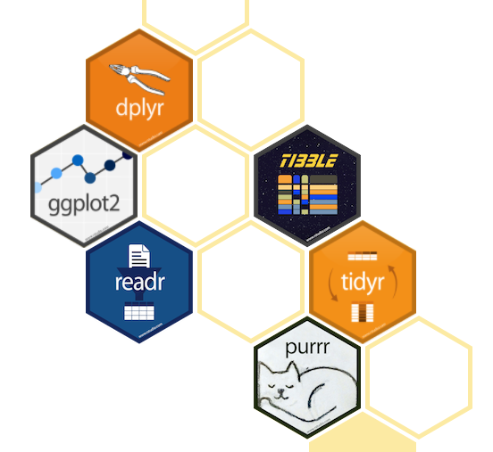
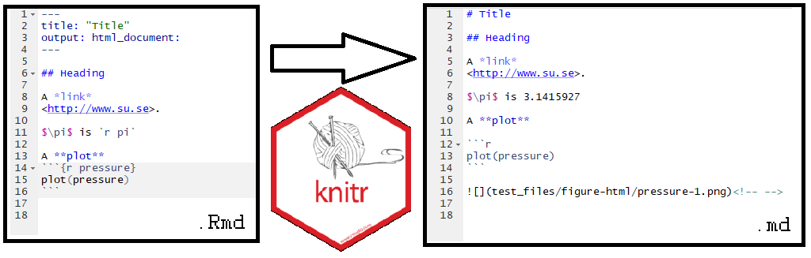
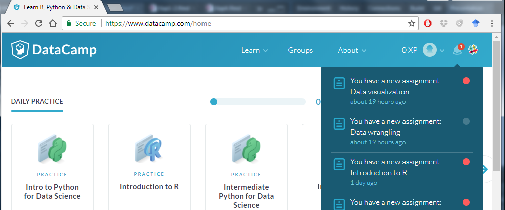
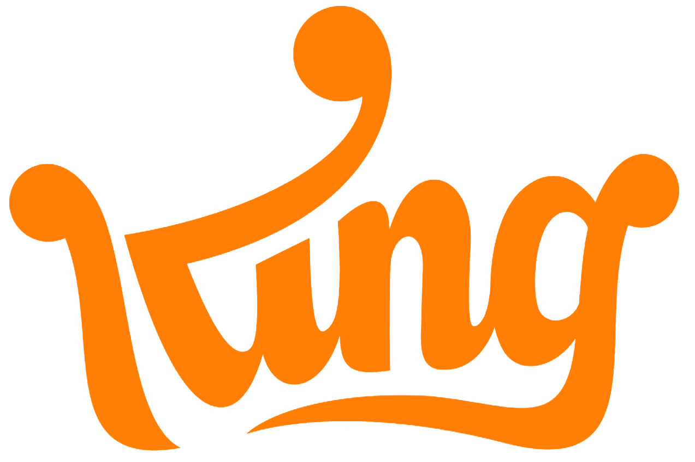
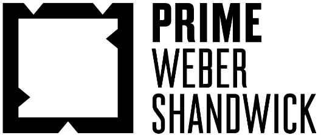

```{r setup, include=FALSE}
knitr::opts_chunk$set(echo = FALSE)
```

# En kurs i Data Science

## Vi kommer inte beröra...

* ...speciella verktyg för saker som är för stora för datorns internminne (Big Data?)...
* ...verktyg för regression och prediktion (Machine learning, Deep learning, ...)...
* ...men kanske Data mining??

## The Data Science Venn Diagram

```{r, out.width = "500px"}
knitr::include_graphics("Data_Science_VD.png")
```

<small> Från <http://drewconway.com/zia/2013/3/26/the-data-science-venn-diagram> </small> 

## Statistisk databehandling

```{r, out.width = "700px"}
knitr::include_graphics("http://r4ds.had.co.nz/diagrams/data-science.png")
```

Matstat-kurser fokuserar oftast helt på **Model**-steget, denna kurs har ambitionen att beröra de övriga.

<small> Bild från: <http://r4ds.had.co.nz/introduction.html> </small>


# Reproducerbarhet

## Klipp, klistra, klicka

* Som statistiker/aktuarie/matematiker skriver du många rapporter.
* Många frestas skapa tabeller och figurer genom att klippa, klistra, klicka i och mellan Excel-ark.
* Exempel: Ta fram en figur över KPI 2017
<https://www.google.se/search?q=kpi+scb>

## Problem


* "Intressant med nedgången på slutet, men vad är månad 13?"
* "Snyggt, men kan jag få en tabell istället?"
* Nästa år får en kollega (eller du själv) samma uppdrag och undrar hur du fick fram uppgifterna.

## Reproducerbar dataanalys

> **Reproducibility**  *is the ability to get the same research results or inferences, based on the raw data and computer programs provided by researchers. * ([**Wikipedia**](https://en.wikipedia.org/wiki/Reproducibility))


* Jfr Replikerbarhet, förmågan att komma fram till samma slutsats baserat på oberoende data/analys.
* Du kan aldrig garantera att du gjort "rätt", men du kan i alla fall dokumentera vad du gjort.

## Reproducerbar dataanalys

* Allt skrivet i kod (inget klickande eller klippande/klistrande av resultat/tabeller/figurer)

* Portabelt (koden skall vara körbar, inte bara på din dator idag)

* Tillgängligt (andra skall enkelt kunna ta del av och reproducera din analys)

* Automatiserat från rådata till rapport (en knapptyckning skall räcka för att generera slutprodukten)

# Verktyg för reproducerbar dataanalys

## Kod: R eller Python?
```{r, out.width = "500px"}

```

## Kod: R ~~eller Python~~!
```{r, out.width = "500px"}

```

## Men varje sak kan göras på många, lite för många, sätt i R.


```
summary(mtcars$mpg)
summary(mtcars$"mpg")
summary(mtcars[, "mpg"])
summary(mtcars["mpg"])
summary(mtcars[["mpg"]])
summary(mtcars[1])
summary(mtcars[, 1])
summary(mtcars[[1]])
with(mtcars, summary(mpg))
attach(mtcars); summary(mpg)
summary(subset(mtcars, select=mpg))
```
<small> Från <http://r4stats.com/articles/why-r-is-hard-to-learn/> </small>

## Kod: ~~Hadleyverse~~ Tidyverse

<div class="columns-2">

```{r, out.width = "300px"}

```


```{r, out.width = "400px"}

```

</div>
En serie R-paket med stort inflytande från Hadley Wickham på RStudio. Snabba, konsistenta och ändamålsenliga funktioner. Fokus i denna kurs.

## Automatisk rapportgenerering

Vi behöver automatiskt kombinera text, resultat, tabeller och figurer.

```{r, out.width = "630px"}
knitr::include_graphics("pandoc1.png")
```

<small> Bild från <https://rosannavanhespenresearch.files.wordpress.com/> </small>


## Automatisk rapportgenerering: Markdown


```{r, out.width = "300px"}
knitr::include_graphics("Markdown-mark.svg.png")
```

Ett märkspråk (markup language) för typsättning.

<http://writeme.mattstow.com/>

## Automatisk rapportgenerering: R Markdown
```{r, out.width = "200px"}
knitr::include_graphics("rmarkdown.png")
```

En utveckling av Markdown som inkluderar körbar kod.

## knitr: .Rmd &#8594; .md

```{r, out.width = "1000px"}

```


## Tillgänglighet (och versionshantering): GitHub och Git

<div class="columns-2">

```{r, out.width = "300px"}
knitr::include_graphics("Git-Logo-2Color.png")
```


```{r, out.width = "300px"}
knitr::include_graphics("Octocat.png")
```

</div>
En mjukvara för versionshantering och en webbaserad lagringstjänst.

## Tillgänglighet: GitHub

* Ett web-hotell för delning av filer, främst programkod
* Bygger på versionshanteringsprogrammet Git med avancerad funktionalitet för att underlätta samarbete
* <https://github.com/Microsoft/malmo>
* <https://github.com/tidyverse/dplyr>


## Versionshantering

<div class="columns-2">
<small> Bild från <http://phdcomics.com/comics/archive.php?comicid=1531> </small>

```{r, out.width = "300px"}
knitr::include_graphics("phd101212s.gif")
```


Inte nödvändigt för reproducerbarhet, men ett måste för stora projekt som pågår under lång tid. Mest en bieffekt av att vi använder GitHub i denna kurs.

</div>

## Allt väl integrerat genom R Studio.

```{r, out.width = "750px"}
knitr::include_graphics("RStudio-Logo-Blue-Gradient.png")
```

Ger även .Rproj för ökad portabilitet.

## Sammanfattning

* Allt skrivet i kod: R

* Portabelt: .Rproj (RStudio)

* Tillgängligt: GitHub

* Automatiserat: R Markdown


# Kursupplägg

## Kursbok

<div class="columns-2">
```{r, out.width = "300px"}
knitr::include_graphics("r4ds.png")
```

<http://r4ds.had.co.nz/>

</div>

## Uppgifter på DataCamp

```{r, out.width = "750px"}

```

Ger grundläggande träning och förberedelse inför lektion. Inte betygsgrundande, men lektioner och handledning kommer förutsätta att de är gjorda.


## Hur använder jag X för att Y?

```{r, out.width = "700px"}
knitr::include_graphics("google.png")
knitr::include_graphics("so-logo.png")
```


## Kursupplägg

* Förberedelse: Uppgifter på [DataCamp](https://www.datacamp.com/home) inför varje lektion.
* Lektioner: Huvudsakligen korta genomgångar följt av programmeringsuppgifter med handledning.
* Examination:
    - 6 inlämningsuppgifter.
    - Digital tentamen.
    - Projekt.
    
## Hemuppgifter (3hp, U/G)

* Sex uppgifter med deadlines följande sex söndagar.
* Löses individuellt och självständigt (begränsad handledning).
* Kanratgranskning.
* Missad deadline/underkänd uppgift: Omexamination i april och eventuellt augusti.
* När nästa kursomgång startar (HT period 2) nollställs alla delresultat.

## E-tenta (1,5hp, A-F, 27/2)

* Två delar: Flervalsfrågor och problemlösning i RStudio-miljö.
* Hjälpmedel: Relevanta Cheatsheets från RStudio.

## Projekt (3 hp, A-F, presentation och deadline 12/3)

* Ett inlägg i en data-blogg.
* Belyser en frågeställning med hjälp av ett unikt datamaterial.
* Handledningstilfällen kommer schemaläggas.
* Kort (5 min) muntlig presentation.


## Gästföreläsningar av "Data Scientists"

1/2: Sebastian Tengborg

```{r, out.width = "200px"}

```

19/2: Mehrdad Mamaghani

```{r, out.width = "250px"}

```


