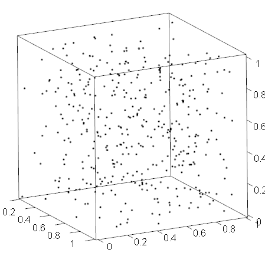
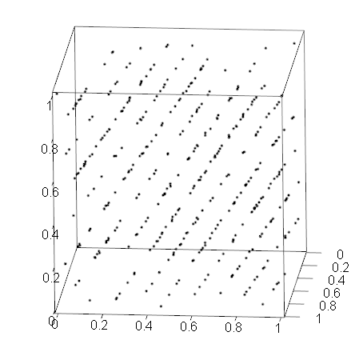

```{r setup, include=FALSE}
knitr::opts_chunk$set(echo = TRUE, warning = FALSE, message = FALSE)
suppressPackageStartupMessages(library(tidyverse))
suppressPackageStartupMessages(library(aplpack))
suppressPackageStartupMessages(library(GGally))
suppressPackageStartupMessages(library(corrplot))

# base scale works poorly with dplyr
my_scale <- function(x)((x-mean(x))/sd(x))
```

# Multivariata och högdimensionella data

## Variabler vs observationer

* Hitta samspel mellan variabler
* Hitta grupper av liknande observationer

## Hur hittar vi liknande observationer?

```{r}
mtcars
```


## Glyfer `stars(mtcars)`

```{r, echo = FALSE, fig.width=8}
stars(mtcars, ncol = 8)
```

## Glyfer `aplpack::faces(mtcars)`
```{r, echo = FALSE, messages = FALSE, fig.width=8}
faces(mtcars, nrow.plot = 4, ncol.plot = 8)
```


## Heatmap (standardiserade var.)

```{r, echo = FALSE, warning=FALSE}
mtcars %>% 
    rownames_to_column("model") %>% 
    mutate_if(is.numeric, scale) %>% 
    gather(key = key, value = value, mpg:carb) %>% 
    ggplot(aes(x = key, y = model)) + geom_tile(aes(fill = value)) + scale_fill_gradient2() + xlab("")
```

## Linjer

```{r, echo = FALSE}
mtcars %>% 
    rownames_to_column("model") %>% 
    mutate_if(is.numeric, my_scale) %>% 
    gather(key = key, value = value, mpg:carb) %>% 
    mutate(x = as.numeric(as.factor(key))) %>% 
    ggplot(aes(x = x, y = value, color = model)) + geom_point() +geom_line(aes(group = model)) +
    xlab("") + scale_x_continuous(breaks = 1:ncol(mtcars), labels = names(mtcars))
```

## Linjer

```{r, echo = FALSE}
mtcars %>% 
    rownames_to_column("model") %>% 
    mutate(cyl = as.factor(cyl)) %>% 
    mutate_if(is.numeric, scale) %>% 
    gather(key = key, value = value, mpg:carb, -cyl) %>% 
    mutate(x = as.numeric(as.factor(key))) %>% 
    ggplot(aes(x = x, y = value, color = cyl)) + geom_point() +geom_line(aes(group = model)) +
    scale_x_continuous(breaks = 1:ncol(mtcars[,-2]), labels = names(mtcars[,-2])) + xlab("")
```


## Samspel `GGally::scatmat(trees)`

```{r, echo = FALSE}
scatmat(trees)
```

## Samspel `GGally::scatmat(mtcars)`

```{r, echo = FALSE}
scatmat(mtcars)
```

## Samspel `GGally::scatmat(randu)`

```{r, echo = FALSE}
GGally::scatmat(randu)
```

## Samspel `rgl::plot3d(randu)`

```{r, out.width = "400px", echo = FALSE}

```

## Samspel `rgl::plot3d(randu)`

```{r, out.width = "400px", echo = FALSE}

```


## Samspel `corrplot::corrplot`
```{r, echo = FALSE}
corrplot(cor(mtcars))
```


## Singulärvärdesuppdelning

Låt $X$ vara matrisen med $d$ variabler i kolumner och $n$ observationer på rader. Antag centrerad. Om $n\geq d$ kan vi göra en singulärvärdesuppdelning (SVD) av $X$

$$
X = UD V^T
$$
där 

* $U$ av dim ($n\times p$) har ortonormala kolumner 
* $D$ är en diagonalmatris med diagonal $d=(d_1,\ldots, d_p)$, $d_1\geq \ldots \geq d_p\geq 0$
* $V$ av dim $(p\times p)$ är en ortogonal matris

## Singulärvärdesuppdelning

$$
\begin{align*}
X & = UD V^T = \sum_{i=1}^p u_id_iv_i^T\\
& \approx \sum_{i=1}^q u_id_iv_i^T = U_{1:n,1:q}D_{1:q}V_{1:q},
\end{align*}
$$
för $q<p$.

## Data `trees` (normaliserade)
```{r, echo = FALSE}
trees_c <- scale(trees) %>% 
    as.data.frame() %>% 
    select(Girth, Volume)
with(trees_c, plot(Girth, Volume, xlim = c(-4, 4), ylim = c(-3,3)))
```


## $u_1$ och $u_2$

```{r, echo = FALSE}
u <- svd(trees_c)$u
d <- svd(trees_c)$d
v <- svd(trees_c)$v
plot(u[,1]*d[1], u[,2]*d[2], xlim = c(-4, 4), ylim = c(-3,3))
```

## Projicerade

```{r, echo = FALSE}
plot(u[,1]*d[1], u[,2]*d[2] * 0, xlim = c(-4, 4), ylim = c(-3,3))
```


## Tillbaka

```{r, echo = FALSE}
plot(u %*% diag(c(d[1], 0)) %*% t(v),  xlim = c(-4, 4), ylim = c(-3,3))
points(trees_c, col = "red")
```

## `mtcars` utan `cyl`

```{r, echo = FALSE}
plot(svd(mtcars[, -2])$u[,1:2])
```

## `mtcars` utan `cyl`

```{r, echo = FALSE}
plot(svd(mtcars[, -2])$u[,1:2], col = as.factor(mtcars$cyl))
```


## Principalkomponenter


1. Bestäm $v_1$ så att $|v_1|=1$ och $variansen hos $X\times v_1$ maximeras.
2. Bestäm $v_2$ så att $|v_2|=1$, $v_1\perp v_2$ och variansen hos $X\times v_2$ maximeras. 
3. Bestäm $v_3$ så att $|v_3|=1$, $v_1\perp v_3$, $v_2\perp v_3$ och variansen hos $X\times v_3$ maximeras. 
4. ...

## Principalkomponenter

* Vektorerna $v_i$ ges av egenvektorerna till kovariansmatrisen $X^TX/n$.
* Men $X^TX=(UD V^T)^TUD V^T=V D U U^TU D V^T=VD^2V^T$ (spektraluppdelning).
* Kolonnerna i $V$ är egenvektorer till $X^TX/n$.

## Tiokamp

```{r, warning=FALSE}
library(GDAdata)
head(Decathlon)
```

## Tiokamp

```{r, echo = FALSE}
scores <- select(Decathlon, starts_with("P"), -Polevault) %>% 
    mutate_all(scale)
plot(svd(scores)$u[,1:2])
```

## `biplot`

```{r, echo = FALSE}
biplot(prcomp(scores))
```

## `biplot`

```{r, echo = FALSE}
biplot(prcomp(scores), col = c("white", "red"))
```


## Klusteranalys

Vi vill hitta kluster av observationer/variabler som liknar varandra

* Om två kolumnerna är nära varandra mäter variablerna samma storhet
* Om två rader är nära varandra är observationerna lika
* Vi begränsar oss till euklidiskt avstånd, kräver standardisering (`scale`)

## Hierarkisk linkage

1. Varje observation utgör ett kluster
2. Slå ihop de två närmaste klustren, bestäm ny avståndsmatris.
3. Upprepa steg 2 tills det bara finns ett kluster.

## Avstånd mellan kluster

* Complete: Största avståndent
* Single: Minsta avståndet
* Average: Medelavståndet

## Visualisera med dendrogram

```{r, echo = FALSE}
scores %>% 
    t() %>% 
    dist() %>% 
    hclust() %>% 
    plot()

```

## Visualisera med dendrogram

```{r, echo = FALSE}
mtcars[, -2] %>% 
    dist() %>% 
    hclust() %>% 
    plot()
```

## Visualisera med dendrogram

```{r, echo = FALSE}
mtcars[, -2] %>% 
    dist() %>% 
    hclust() %>% 
    plot(labels = mtcars$cyl)
```

## Heatmap sorterad efter klustring

```{r, echo = FALSE}
cluster_obs <- cutree(hclust(dist(mtcars[, -2])), k = 3)
mtcars %>% 
    rownames_to_column("model") %>% 
    select(-cyl) %>% 
    mutate_if(is.numeric, my_scale) %>% 
    mutate(model = reorder(model, cluster_obs), cluster = cluster_obs) %>% 
    gather(key = key, value = value, mpg:cluster) %>% 
    ggplot(aes(x = key, y = model)) + geom_tile(aes(fill = value)) + scale_fill_gradient2() + xlab("")
```


